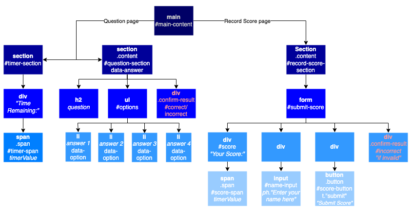

# code_quiz

Quiz built using JavaScript, Web APIs and CSS to render question pages from object content using a loop, render alert to feedback whether correct answer was selected and display high scores from local storage.

[Deployed GitHub URL](https://Kris1825.github.io/code-quiz/)

## Technologies

- HTML
- CSS
  - Animation
  - Media queries
  - Flexbox
  - Variables
- JavaScript
  - Objects
  - Arrays
  - Event Listeners
  - Template Strings
  - Event Bubbling
  - Loops
  - Conditional Statements
- Web APIs
  - Document Object Model
  - Local Storage
  - Intervals
  - Timeout
- GitHub Pages

## Screenshots

<details>
<summary>DOM tree</summary>



</details>

<details>
<summary>Start page</summary>


</details>

<details>
<summary>Question page desktop viewport</summary>


</details>

<details>
<summary>Question page mobile viewport</summary>


</details>

<details>
<summary>Record score page</summary>


</details>

<details>
<summary>High scores page</summary>


</details>
</br>

## User Story

```
AS A coding boot camp student
I WANT to take a timed quiz on JavaScript fundamentals that stores high scores
SO THAT I can gauge my progress compared to my peers
```

## Acceptance Criteria

```
GIVEN I am taking a code quiz
WHEN I click the start button
THEN a timer starts and I am presented with a question
WHEN I answer a question
THEN I am presented with another question
WHEN I answer a question incorrectly
THEN time is subtracted from the clock
WHEN all questions are answered or the timer reaches 0
THEN the game is over
WHEN the game is over
THEN I can save my initials and my score
```
